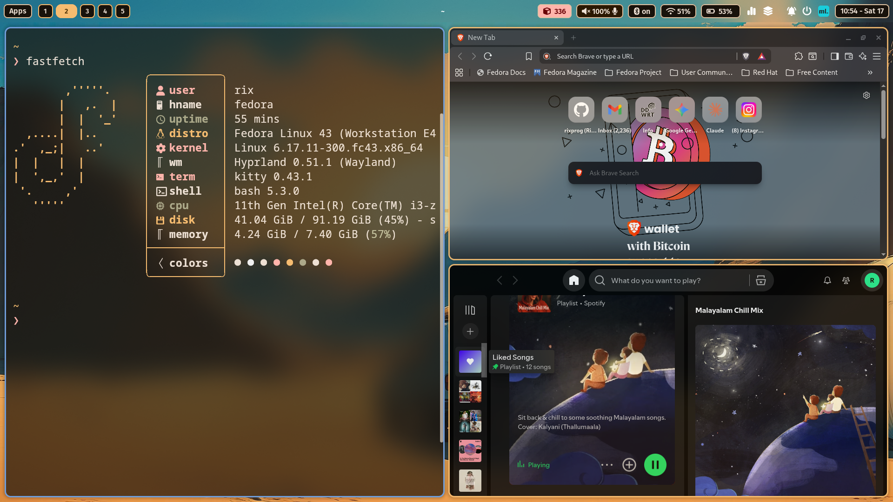
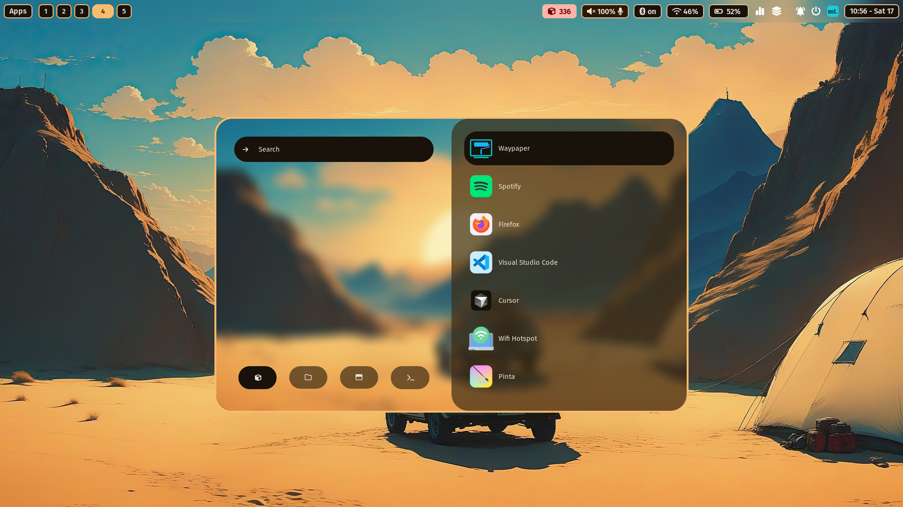

# Dotfiles – Hyprland (Fedora)

My personal Linux configuration files for a minimal, fast, and developer-friendly workstation.

- **OS:** Fedora Workstation
- **WM:** Hyprland (Wayland)
- **Terminal:** Kitty
- **Shell:** Bash / Zsh
- **Editor:** Neovim
- **Bar:** Waybar
- **Launcher:** Rofi

> **Credit:** This configuration is based on [ML4W's dotfiles](https://github.com/mylinuxforwork/dotfiles) with personal modifications and adaptations for my workflow.

---

## 📸 Overview





---

## ✨ Features

- Clean Hyprland tiling workflow
- Keyboard-driven setup
- Minimal visual clutter
- Fast terminal + Neovim development environment
- Wayland-native stack
- Modular configuration layout
- Multi-machine support

---

## 📁 Tracked Structure

```
.config/
  hypr/
  waybar/
  kitty/
  nvim/
  rofi/
  swaync/
  fastfetch/
  ohmyposh/
.bashrc
.zshrc
.gitconfig
.Xresources
.wm_screenshots/
```

---

## 🔒 Security

Sensitive data is **never tracked**:

- `.ssh/`
- `.git-credentials`
- API keys / tokens
- `.env` files
- Browser profiles
- Cache directories

A global ignore file is enforced using:

```
~/.gitignore_global
```

---

## 🚀 Installation (New Machine)

This setup uses the **bare Git repository** method (no symlinks, no clutter).

---

### 1️⃣ Clone the repository

```bash
git clone --bare git@github.com:rixprog/dotfiles.git ~/.dotfiles
```

### 2️⃣ Setup alias

```bash
echo "alias dot='git --git-dir=$HOME/.dotfiles --work-tree=$HOME'" >> ~/.bashrc
source ~/.bashrc
```

### 3️⃣ Checkout files

```bash
dot checkout
```

If conflicts appear:

```bash
mkdir -p ~/.dotfiles-backup
dot checkout 2>&1 | grep -E "\s+\." | awk '{print $1}' | xargs -I{} mv {} ~/.dotfiles-backup/{}
dot checkout
```

### 4️⃣ Hide untracked files

```bash
dot config --local status.showUntrackedFiles no
```

✅ **Done.**

---

## 🙏 Acknowledgments

- [ML4W (MyLinuxForWork)](https://github.com/mylinuxforwork/dotfiles) – Original dotfiles inspiration and base configuration
- The Hyprland community
- All the amazing open-source projects that make this setup possible


